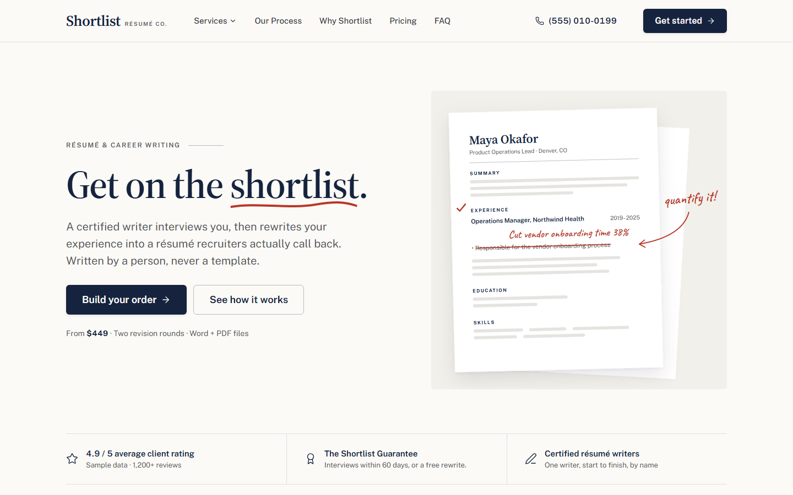
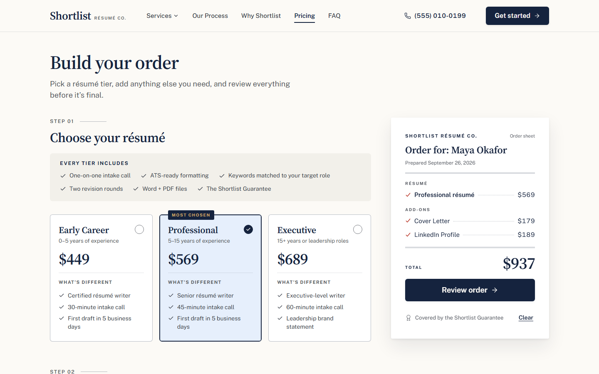
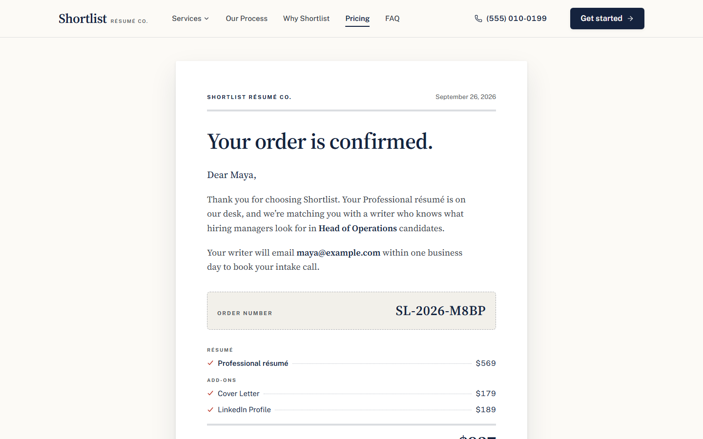
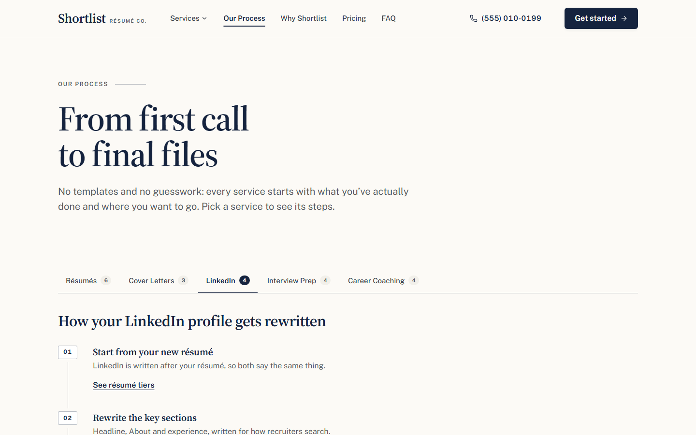
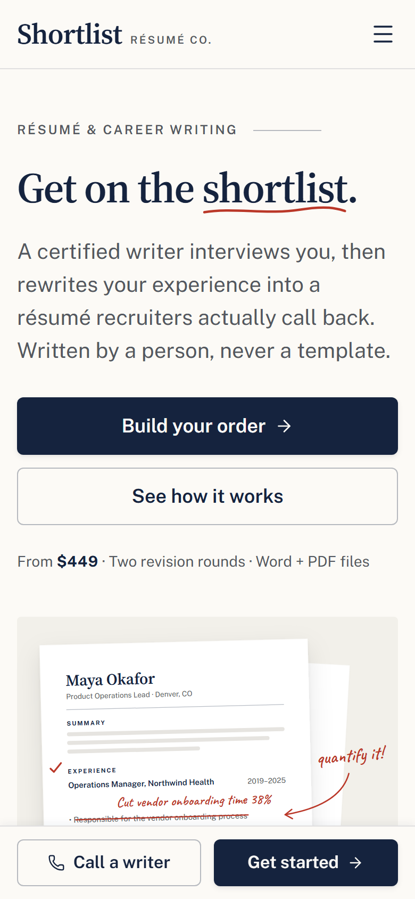
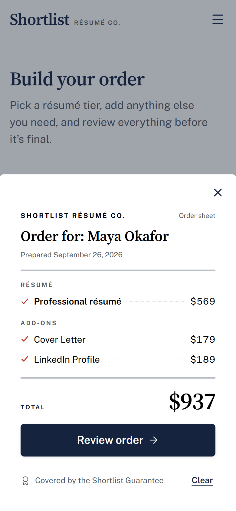

# Shortlist Résumé Co.

A marketing site and order flow for a résumé-writing service, built as a
portfolio project. The structure is modeled on a real résumé-writing business;
the brand, copy, prices, testimonials and logos are all invented.

> **Portfolio demo.** Shortlist Résumé Co. is a fictional company. No orders are
> processed, no payment is taken, and forms send nothing anywhere.



## What's in it

- **Five pages:** Home, a Pricing configurator, Why Shortlist, Our Process and FAQ & Contact, plus a 404 page.
- **An order flow that works end to end.**
  - Pick a résumé tier, add services, and watch the total build on the *Order Sheet*.
  - Enter your details and get a confirmation letter with an order number.
  - It keeps state across refreshes, handles deep links (`#/pricing?tier=executive&addon=linkedin`) and guards its routes.
- **Content kept apart from markup.** Every price, tier, testimonial, FAQ and nav link lives once in [`src/data/`](src/data/); components only render it.
- **Accessibility built in, not added later.**
  - Real radio and checkbox inputs under the option cards.
  - WAI-ARIA tabs and a disclosure-pattern mega menu, plus native `<details>` and `<dialog>`.
  - Focus moves to the new content on navigation.
  - A skip link, and no failing contrast pairs.

| Order configurator | Confirmation letter |
|---|---|
|  |  |

| Process tabs | Mobile | Mobile order sheet |
|---|---|---|
|  |  |  |

## Design: "The Hiring Desk"

The visual system comes from the world the product lives in: a recruiter's desk.

- **Palette:** offer-letter navy on résumé-paper neutrals, with a correction-pen red kept for edit marks and errors. Brass appears only on navy.
- **Type:** Source Serif 4 for headlines (letterhead), Public Sans for interface text, and Caveat handwriting only for the red-pen notes and the letter's signature.
- **Signature element:** the Order Sheet. Your order is typeset like a résumé being assembled, with small-caps sections, dotted leaders to the prices, and a red tick drawn as each line lands. It ends as a signed confirmation letter.
- **Depth:** paper on a desk. One soft shadow family and nearly square corners.

All tokens are in [`src/styles/tokens.css`](src/styles/tokens.css). The full
rationale, page specs and a dated decision log are in [`docs/PRD.md`](docs/PRD.md).

## Stack

React 19 + Vite, `react-router-dom` (HashRouter, for GitHub Pages),
`lucide-react` icons, and self-hosted fonts via Fontsource. The CSS is plain,
using cascade layers (`tokens → reset → base → components → utilities`), with
one stylesheet per component. There's no UI library.

## Run it

```bash
npm install
npm run dev          # local dev server
npm run build        # production build to dist/
npm run preview      # serve the build
```

## Quality checks

```bash
npm run lint         # oxlint
npm test             # Vitest: order logic, validation (26 tests)
npm run test:e2e     # Playwright: order flow, pages, keyboard, axe, desktop + mobile (64 tests)
npm run screenshots  # regenerate docs/screenshots and the social-share image
```

The first `test:e2e` run needs a browser: `npx playwright install chromium`.

**Accessibility.** axe (WCAG 2.2 AA + best practices) runs in the e2e suite:
- It covers every route and every interactive state: menus open, form errors showing, the bottom sheet, and the confirmation letter.
- Any serious or critical violation fails the build.

**Lighthouse** (production build, local):

| Page | Performance (desktop) | Performance (mobile) | Accessibility | Best practices | SEO |
|---|---|---|---|---|---|
| Home | 98 | 80 | 100 | 100 | 100 |
| Pricing | 99 | 78 | 100 | 100 | 100 |
| Why Shortlist | 99 | 88 | 100 | 100 | 100 |

Cumulative layout shift is about 0 on every page. That comes from metric-matched
fallback fonts, sized per weight so text doesn't re-wrap when the web fonts arrive.

Mobile performance is held back by React's startup cost under Lighthouse's
4× CPU throttling. Preloading the fonts (fixed-name font files plus
`<link rel="preload">`) is the next lever if it ever matters.

## Project map

```
docs/PRD.md          spec, design system, decision log, acceptance criteria
src/data/            all content (single source of truth)
src/order/           order state: pure reducer + selectors (unit tested), provider, hook
src/components/      UI components, each with its own CSS file
src/pages/           one component per route (all but Home load on demand)
src/styles/          tokens, reset/base, layer order
e2e/                 Playwright specs
scripts/             screenshot generator
```

`CLAUDE.md` and the README in each folder explain what lives where and why.

## Deploy

`.github/workflows/deploy.yml` runs lint, unit tests and the e2e suite on every
push and pull request. On pushes to `master` it also publishes `dist/` to GitHub
Pages. To enable it, set Settings → Pages → Source to "GitHub Actions".

No repo name needs configuring: the build uses relative asset paths
(`base: './'`).
